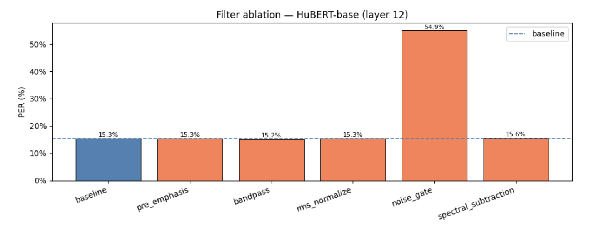

# HW1: Phoneme Recognition + Audio Filters

**Authors:** Roman Pavlosiuk, Iryna Denysova

---

## Task 1 - Phoneme Recognition on TIMIT

### 1. Data Overview

TIMIT is a dataset of 630 American English speakers, each reading 10 sentences recorded at 16 kHz. Each recording comes with a `.PHN` file that says exactly which phoneme was spoken at each moment.

- Train: 3696 utterances
- Test: 1344 utterances

The data is very clean - recorded in a studio with professional microphones. Labels are manually verified, not auto-generated.

**Problems we had to deal with:**

TIMIT has 61 phonemes, but a lot of them sound almost the same. The standard solution is to merge similar ones down to **39 phonemes** (for example `ao -> aa`, `ix -> ih`). All our results are measured on these 39.

We also removed SA sentences from the dataset. All 630 speakers read the exact same 2 SA sentences, so if we kept them the model could just memorize those specific recordings instead of actually learning phonemes.

The task itself is also just hard — phoneme boundaries in real speech are not sharp. One sound blends smoothly into the next, so even the labels are approximate.

---

### 2. Approach

We did not train a model from scratch. Instead, we took large pre-trained speech models, froze them, and used their internal features to train a small classifier.

The idea is that wav2vec2 and HuBERT were pre-trained on 960 hours of speech and already know a lot about how audio works. We just need to teach the classifier which features correspond to which phoneme.

**How the pipeline works:**
1. Pass each audio file through the SSL model once and save the output - one 768-dimensional vector per 20ms frame
2. Train a small MLP on those saved vectors using phoneme labels
3. At test time: run the MLP frame by frame, collapse consecutive identical predictions into a sequence, compare to the reference with edit distance

**The two SSL models we used:**

Both have the same structure inside: a CNN that converts raw audio into frames, then 12 transformer layers that add context. The difference is how they were trained:

- **wav2vec2-base** - trained to pick the correct speech unit from a set of fake ones (contrastive learning)
- **HuBERT-base** - trained to predict cluster labels (k-means clusters of MFCC features) at masked positions

**The MLP classifier:**
```
Linear(768 -> 512) -> LayerNorm -> ReLU -> Dropout(0.1) -> Linear(512 -> 39)
```
Trained for 15 epochs with Adam and cosine annealing.

**How we measure quality — PER (Phoneme Error Rate):**
```
PER = edit_distance(predicted, reference) / len(reference)
```
Lower is better. PER of 15% means roughly 85% of phonemes are correct.

---

### 3. Metrics

**Last layer (layer 12) results:**

| Model | PER |
|---|---|
| wav2vec2-base | 38.31% |
| HuBERT-base | **15.09%** |

**Layer sweep — wav2vec2-base:**

| Layer | PER |
|---|---|
| 0 (CNN only) | 46.40% |
| 3 | 36.69% |
| **6** | **21.67%** |
| 9 | 22.37% |
| 12 (last) | 37.56% |

**Layer sweep — HuBERT-base:**

| Layer | PER |
|---|---|
| 0 (CNN only) | 48.19% |
| 3 | 42.18% |
| 6 | 22.92% |
| 9 | 17.20% |
| **12 (last)** | **15.11%** |

**Summary:**

| Configuration | PER |
|---|---|
| wav2vec2-base, last layer | 38.31% |
| wav2vec2-base, best layer (6) | 21.67% |
| HuBERT-base, last layer | 15.09% |
| HuBERT-base, best layer (12) | 15.11% |

---

### 4. Hypotheses and Results

**HuBERT is way better than wav2vec2 (15% vs 38%).**
We expected this going in. HuBERT was trained to predict cluster labels - which is basically a simplified version of phoneme classification. wav2vec2 used contrastive learning, which is less directly related to what phonemes are. So HuBERT's features naturally work better for our task.

**For wav2vec2, the best layer is layer 6, not layer 12.**
This was a bit surprising. We thought the last layer would have the most useful features. But it turned out to be one of the worst (37.56%). The top layers of wav2vec2 get shaped by the contrastive loss in a way that makes them less useful for phoneme classification. The middle layers still carry clean acoustic information before the model abstracts it away.

**For HuBERT, deeper is always better.**
PER goes down steadily from CNN output (48%) all the way to layer 12 (15%). HuBERT's pre-training pushes every layer toward phoneme-like representations, so there is no point where quality drops off.

**CNN alone is bad for both models**
Without the transformer layers, the features only capture what's happening in a tiny local window. That's not enough to reliably tell phonemes apart - you need context from surrounding frames too.

---

## Task 2 - Audio Filters

### 1. Filtering Algorithms

We wrote 5 audio filters and tested whether applying them before feature extraction helps. Each filter takes a raw audio array and returns a cleaned one of the same length.

**Pre-emphasis**
```
y[t] = x[t] - 0.97 * x[t-1]
```
Boosts high frequencies by subtracting a scaled version of the previous sample. Makes consonants like `s`, `f`, `sh` sharper. A classic step in traditional speech processing pipelines.

**Bandpass filter**

Keeps only 80–7600 Hz using a Butterworth filter. Cuts low-frequency rumble (below 80 Hz) and the very top edge near Nyquist. Speech doesn't really exist outside this range anyway.

**RMS normalize**

Scales each utterance so all recordings have the same loudness. Some TIMIT speakers are recorded louder than others — this makes the amplitude consistent before the audio goes into the model.

**Noise gate**

Splits audio into 20ms frames and zeros out any frame whose energy is below –40 dB. Designed to silence background hiss in the pauses between words.

**Spectral subtraction**

Estimates background noise from the first 10 frames (assumed to be silence before speech starts), then subtracts that estimate from every frame. Audio is then reconstructed via inverse STFT. A noise reduction method from the 1970s.

---

### 2. Ablation Study

We tested each filter independently using HuBERT-base (layer 12) with the same setup as Task 1.

| Filter | PER | vs baseline |
|---|---|---|
| baseline (no filter) | 15.28% | — |
| pre_emphasis | 15.28% | 0.00% |
| bandpass | **15.21%** | −0.07% |
| rms_normalize | 15.34% | +0.06% |
| noise_gate | 54.95% | +39.67% |
| spectral_subtraction | 15.62% | +0.34% |



Almost nothing helped. Four out of five filters stayed within ±0.4% of baseline — basically no difference. TIMIT is a clean studio dataset, so there is no noise to remove. Applying noise-removal filters to already-clean audio just slightly damages the signal.

Bandpass was the only filter that gave any improvement (15.21%), and it's tiny. It cuts frequencies that have no speech information at all, so at least it doesn't make things worse.

Pre-emphasis did nothing (15.28% = exactly baseline). HuBERT's CNN already applies its own learned frequency shaping during feature extraction, so doing pre-emphasis manually beforehand is just redundant.

Noise gate completely broke the model — PER jumped to 54.95%. The –40 dB threshold zeroed out not just silence but also quiet speech frames. HuBERT was never trained on audio with sudden chunks of zeros in the middle of words, so the model got very confused.

Spectral subtraction made things slightly worse (15.62%). Since the audio is already clean, it estimates the noise floor as nearly zero and then oversubtracts, creating small ringing artifacts that weren't there before.

The overall takeaway is that traditional audio filters are designed for noisy recordings. On clean data like TIMIT they don't help. If we wanted to actually improve the model, a better approach would be adding noise to the training data, not removing noise that isn't there.
